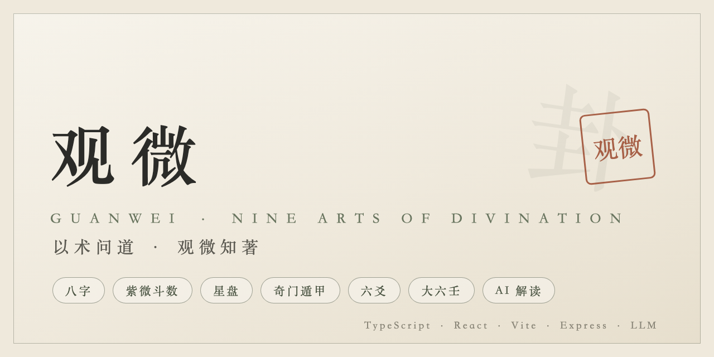
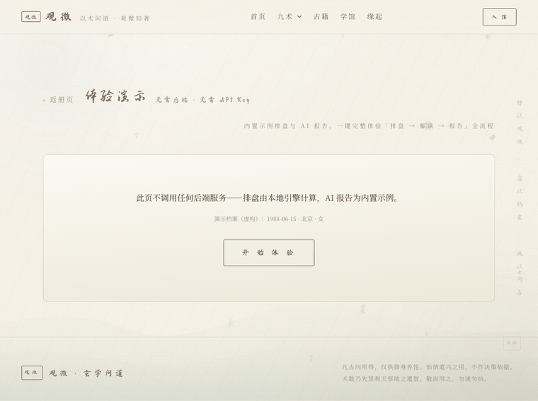
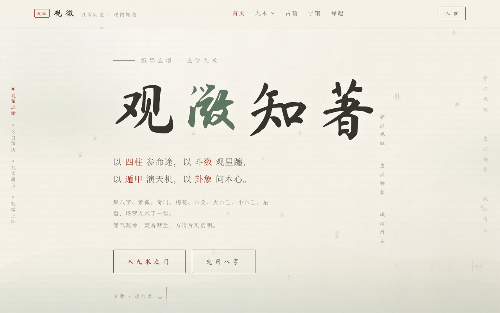
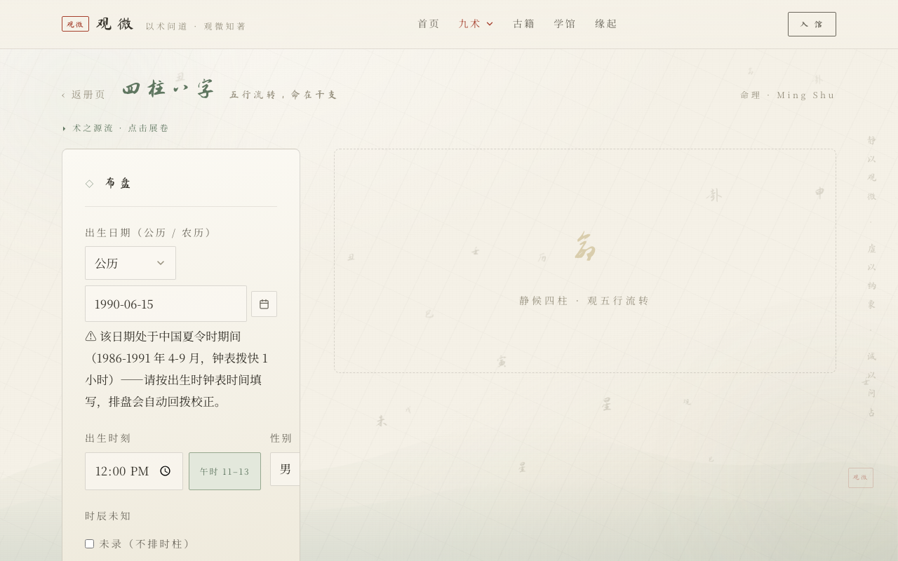

# Guanwei · Ask the Way through Divination

<p align="center">
  
</p>

<p align="center">
  <a href="https://github.com/RubyCcll/guanwei/actions/workflows/ci.yml"></a>
  <a href="https://rubyccll.github.io/guanwei/"></a>
  <a href="https://github.com/RubyCcll/guanwei/releases"></a>
  <a href="LICENSE"></a>
  <a href="https://github.com/RubyCcll/guanwei"></a>
  <a href="https://github.com/RubyCcll/guanwei/issues"></a>
</p>

<p align="center">
  [English](README.en.md) · [简体中文](README.md)
</p>

An open-source Chinese metaphysics application covering **nine arts of divination** — Bazi (Eight Characters), Ziwei Doushu, classical astrology, Qimen Dunjia, Liuyao, Da Liu Ren, Meihua, Xiaoliuren and Tarot — with **AI-powered in-depth interpretation** backed by rigorous chart-fact consistency checks.

> All readings are for reflection and entertainment only; never a basis for real decisions.

## ▶️ Try It Now (No Sign-up · No API Key)

<p align="center">
  <a href="https://rubyccll.github.io/guanwei/#/demo"></a>
  <br><a href="https://rubyccll.github.io/guanwei/#/demo"><b>▶ Open the Interactive Demo</b></a> — <b>all nine arts computed locally in your browser</b> (zero backend), Bazi includes a full sample AI report.
</p>

## Screenshots

<p align="center">
  
  
</p>

## ✨ Features

### Nine Arts of Divination (deterministic calendar computation, single shared engine)
| Category | Arts |
|---|---|
| Natal charts | Bazi (Ziping), Ziwei Doushu, Classical astrology (VSOP87 ecliptic) |
| Divination | Qimen Dunjia, Meihua, Liuyao, Da Liu Ren, Xiaoliuren, Tarot |

- **Gregorian/Lunar dual-calendar** birth input, precise to the minute (east-Asian arts use the two-hour shichen, astrology uses exact time)
- Location down to **province/city/district → longitude/latitude** (true solar time correction, including 1986–1991 China DST rollback); falls back to Beijing time with a clear notice when location is omitted
- **Unknown birth hour support**: charts without the hour pillar, plus **hour inference from life events** (year × hour-pillar interaction scoring)
- **Dynamic chart narration**: personalized summaries generated from the actual chart (day master × season × strength × ten gods × five-element balance × luck cycles)
- Results computed by the backend and **persisted to SQLite**

### AI Deep Interpretation
- 9 agents × skill orchestration (e.g. Ziwei: chart structure → star palaces → twelve houses → major cycles → life stages)
- **Dual schemas**: natal-chart reports (raw reading / character / family / mind / life stages / career / love / wealth / health) and divination reports (situation / trend / timing)
- **Chart-fact consistency**: the AI must quote chart data verbatim; the backend **verifies six-relations facts** (palace branch, main stars, borrowed stars, four transformations) and patches contradictions
- **Stable readings**: cached chart-parsing step, low sampling temperature, evidence-anchored claims, de-duplication with word budgets
- **Life-event calibration**: record known life events; the AI echoes them at the matching years and never contradicts them
- Question–art **suitability analysis** (e.g. Qimen is not advised for romance questions)
- Streaming generation + structured report cards; export to Markdown / PDF

### Other
- Classics pages, academy (history and knowledge of the nine arts)
- Profile management (primary/sample profiles), divination history with AI reports

## 🏗️ Architecture

```
Frontend: React 18 + TypeScript + Vite + Tailwind (Song-dynasty aesthetics)
Backend:  Express + tsx (SSE streaming + SQLite)
Shared:   shared/core/engine/* — single source of truth for all chart algorithms
AI:       multi-LLM adapter (OpenAI-compatible & Google formats; DeepSeek / Gemini / Groq / Qwen / custom)
```

## 🚀 Quick Start (one-liners)

### ⚡ Recommended: npm one-liner (fast, seconds)

```bash
npm i -g guanwei
guanwei setup --key YOUR_API_KEY
guanwei start
```

Open http://localhost:5173 . Upgrade: `guanwei update`. Stop: `guanwei stop`.

### ⚡ Docker one-liner (no Node needed, easiest)

```bash
docker run -d --name guanwei -p 5173:80 -e LLM_DEEPSEEK_KEY=YOUR_API_KEY ghcr.io/rubyccll/guanwei:latest
```

Open http://localhost:5173 . Stop: `docker stop guanwei`. Other providers: `-e LLM_PROVIDER=gemini -e LLM_GEMINI_KEY=...` (deepseek / gemini / groq / qwen / custom).

### ⚡ Source installer (fallback)

```bash
curl -fsSL https://raw.githubusercontent.com/RubyCcll/guanwei/main/scripts/install.sh | bash
guanwei setup --key YOUR_API_KEY
guanwei start
```

### Detailed options (Codespaces / Compose / local Node)

**One step: configure your API key** (DeepSeek / Gemini / Groq / Qwen / custom endpoint).

#### Option 4: GitHub Codespaces (zero local setup)

[](https://codespaces.new/RubyCcll/guanwei)

Click the button → dependencies are installed automatically → run:

```bash
./scripts/setup.sh --key YOUR_API_KEY
```

#### Option 5: Docker Compose

Prebuilt images are published to GitHub Container Registry (amd64 + arm64):

```bash
./scripts/setup.sh --docker --key YOUR_API_KEY
# or manually: cp server/.env.example server/.env → docker compose up -d
```

Open http://localhost:5173 . Stop with `docker compose down`.

Images: `ghcr.io/rubyccll/guanwei-guanwei-web` / `guanwei-guanwei-backend`; override ports with `WEB_PORT=5180 API_PORT=3020 docker compose up -d` if needed.

#### Option 6: Local Node.js (≥ 22)

```bash
./scripts/setup.sh --key YOUR_API_KEY   # interactive mode: run ./scripts/setup.sh
```

The script installs dependencies, writes `server/.env` (key stays local), and starts both servers. Open http://localhost:5173 → register → cast a chart → summon the AI report.

### 🖥️ Guanwei CLI (start / update / self-check)

```bash
npm link        # install globally (or use ./scripts/guanwei directly)

guanwei setup --key sk-xxx   # configure API key (interactive: guanwei setup)
guanwei start                # start (--docker for containers)
guanwei doctor               # environment self-check (Node/config/ports/deps/version)
guanwei update               # update to latest (git incremental merge; local config preserved)
guanwei check / status       # version check / status
guanwei stop                 # stop (docker mode)
```

> `guanwei update` uses **git incremental merge**: only pulls remote changes, keeps all local config (`.env` etc. are gitignored); uncommitted local edits are auto-stashed and restored.

### 🔑 Getting an API Key (5 providers)

| Provider | Portal | Notes |
|---|---|---|
| **DeepSeek** (recommended) | https://platform.deepseek.com | Best value, strong Chinese |
| Groq | https://console.groq.com | Free tier |
| Gemini | https://aistudio.google.com/apikey | Free tier |
| Qwen (Alibaba) | https://dashscope.console.aliyun.com/ | China-friendly |
| Custom endpoint | any OpenAI-compatible API | `--provider custom` |

Then run `./scripts/setup.sh --key YOUR_KEY` (Windows: `scripts/setup.bat --key YOUR_KEY`); the UI shows a clear guide when the key is missing.

### Tests
```bash
npm test    # 181 tests (engines / rendering / interactions / storage / prompts)
```

## 📁 Structure

```
├── src/                 # Frontend (pages / components / hooks / services)
├── server/
│   ├── src/routes/      # divine / ai / users / hour
│   └── src/services/    # promptBuilder / llmProvider / divineStore / hourInference / relativesCheck / sixRelatives
├── shared/core/         # Shared chart engines (single copy)
├── scripts/             # setup.sh / guanwei CLI / release.sh / setup.bat (Windows)
├── deploy/              # nginx config (Docker)
├── .devcontainer/       # GitHub Codespaces template
├── Dockerfile.web / Dockerfile.server / docker-compose.yml
├── docs/                # Open-source assets (banner / screenshots / GIF / sample report)
└── tests/               # Tests (incl. regression set)
```

## 🔐 Security
- Keys live only in local `server/.env` (gitignored); Docker builds exclude `.env` via `.dockerignore`
- Test data is fully fictional/anonymized — no real personal information in this repository

## 📄 Sample Output

- [Sample AI report (PDF)](docs/assets/sample-report.pdf) (fictional profile, generated by the real pipeline)

## 🤝 Contributing

See [CONTRIBUTING.md](CONTRIBUTING.md) — including the **zero-privacy policy** (no real user data, keys, or personal info in this repository). Releases follow semantic versioning — see [CHANGELOG.md](CHANGELOG.md).

## 📄 License
[MIT](LICENSE)

---

**Guanwei** · 以术问道，观微知著。 Long-term maintenance — welcome to Star & open Issues.
